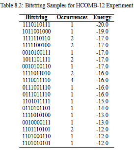

# QuantumHoneycombPSP

QuantumHoneycombPSP is a Python-based project designed to model protein structure prediction (PSP) using quantum computing techniques. The project includes various modules to encode sequences, generate energy matrices, and create energy functions for different lattice types. It also supports the conversion of these energy functions into Quadratic Unconstrained Binary Optimization (QUBO) and Ising models. Then runs the QUBO model on D-Wave's quantum annealer to predict the protein structure.

## Features

- **Sequence Encoding**: Encode protein sequences using different models such as HP, HPAB, and WHPAB.
- **Energy Matrix Generation**: Generate energy matrices based on the encoded sequences and selected energy models.
- **Energy Function Creation**: Create energy functions for different lattice types (4, 6, 8, 12) and convert them into QUBO and Ising models.
- **Interaction Calculation**: Calculate interactions between amino acids in the sequence and generate corresponding energy values.
- **QUBO Variable Mapping**: Map QUBO variables to a new format for further processing.
- **Running QUBO on D-Wave**: Run the QUBO model on D-Wave's quantum annealer to predict the protein structure.
- **Getting Sample Dates**: Get sample data from D-Wave's quantum annealer to predict the protein structure.
- **Structure Imager**: Generate images of protein structures based on the encoded sequences.

## Installation

To install the required dependencies, run:

```bash
pip install -r requirements.txt
```

Also change the API token in the `Annealer.py` file to run the QUBO model on D-Wave's quantum annealer.

## Usage

### QUBO CLI

The main.py script can be used as a command-line interface (CLI) to specify the sequence, energy model, lattice type, and whether to use the binary model.
Command-Line Arguments

- sequence: Protein sequence (e.g., 'GAAGA')
- energy_model: Energy model (choices: 'HP', 'HPAB', 'WHPAB', 'MJ')
- lattice_type: Lattice type (choices: 4, 6, 8, 12)
- --binary: Use the binary model (optional flag)

### Output

The script will output the following information:

- Encoded sequence
- Interaction matrix
- QUBO, BQM, and Ising models (if --binary is not used)
- Mapped QUBO variables
- Final QUBO equation

### Example Command

```bash
python main.py GAAGA HP 4 --binary
```

### Visualization CLI

The Visualize.py script can be used to visualize the protein sequence on a lattice.
Command-Line Arguments

sequence: Protein sequence (e.g., 'GAAGA')
energy_model: Energy model (choices: 'HP', 'HPAB', 'WHPAB', 'MJ')
lattice_type: Lattice type (choices: 4, 6, 8, 12)
binary_output: Binary move output from QUBO

Example Command

```bash
python Visualize.py GAAGA HP 4 101110
```

### Output

The script will output the following information:

- A Matplotlib image of the protein sequence on the lattice
- The energy value of the protein sequence

## Example Experiment

We consider the pentapeptide YGGFM, which is Met-enkephalin Tyr-Gly-Gly-Phe-Met an endogenous opioid peptide involved in regulating nociception (pain sensation) in the body. We use ten binary turn qubits to represent the folding directions and 68 ancillary qubits to reduce higher-order terms in the QUBO formulation. We used MJ energy model on a HCOMB12 Lattice.

```bash
python main.py YGGFM MJ 12
```




Then, the top two most occurring proteins, bitstrings, were visualized to produce the following images.

```bash
python Visualize.py YGGFM MJ 12 1101001010
python Visualize.py YGGFM MJ 12 1101011010
```


## License

This project is licensed under the MIT License - see the [LICENSE](LICENSE) file for details.
